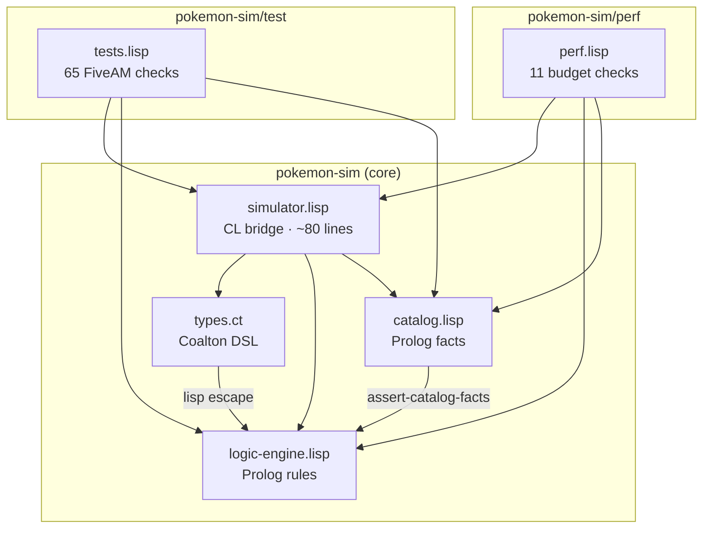
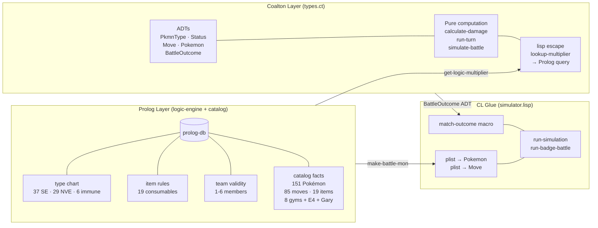
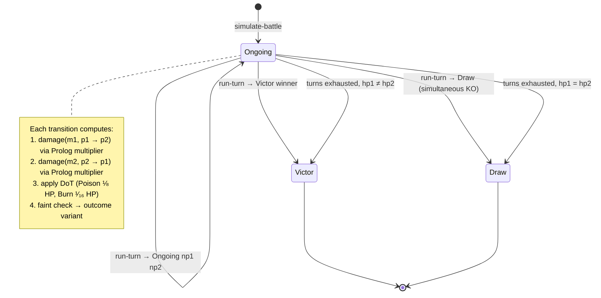
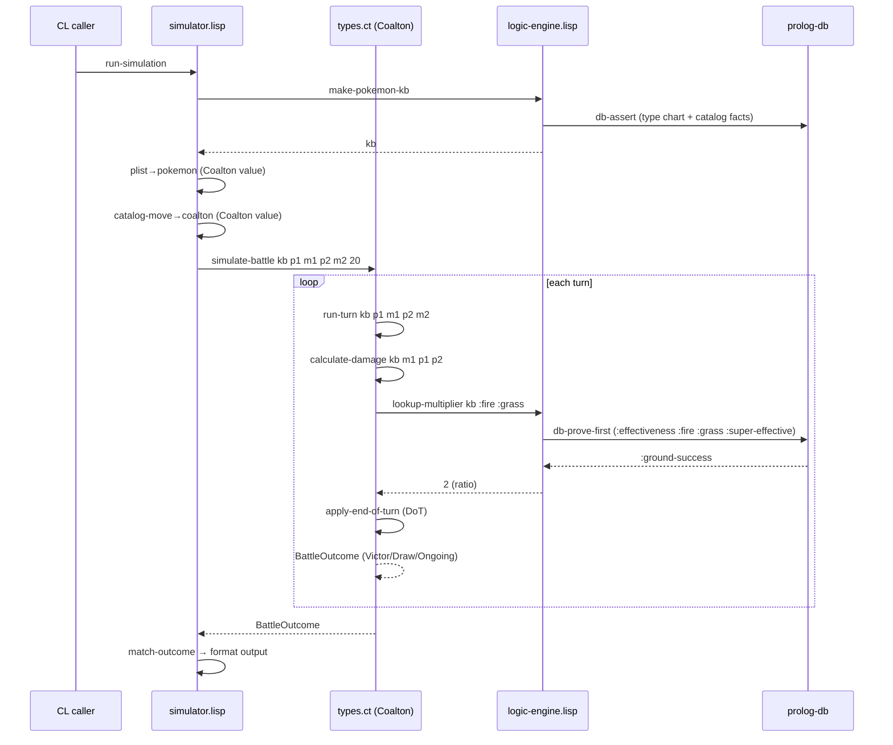
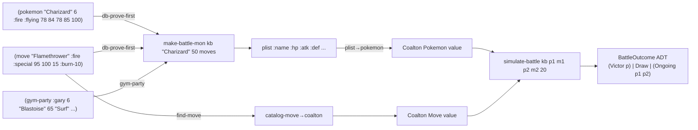

# ml-prolog-pokemon — Architecture Diagrams

## System Architecture

```mermaid
graph TD
    subgraph "pokemon-sim/test"
        T[tests.lisp<br/>65 FiveAM checks]
    end

    subgraph "pokemon-sim/perf"
        P[perf.lisp<br/>11 budget checks]
    end

    subgraph "pokemon-sim (core)"
        SIM[simulator.lisp<br/>CL bridge · ~80 lines]
        CT[types.ct<br/>Coalton DSL]
        CAT[catalog.lisp<br/>Prolog facts]
        LE[logic-engine.lisp<br/>Prolog rules]
    end

    T --> SIM
    T --> LE
    T --> CAT
    P --> SIM
    P --> LE
    P --> CAT
    SIM --> CT
    SIM --> LE
    SIM --> CAT
    CT -->|lisp escape| LE
    CAT -->|assert-catalog-facts| LE
```

## Layer Responsibilities

```mermaid
graph LR
    subgraph Prolog["Prolog Layer (logic-engine + catalog)"]
        direction TB
        KB[(prolog-db)]
        TC[type chart<br/>37 SE · 29 NVE · 6 immune]
        IT[item rules<br/>19 consumables]
        TV[team validity<br/>1-6 members]
        CF[catalog facts<br/>151 Pokémon<br/>85 moves · 19 items<br/>8 gyms + E4 + Gary]
        KB --- TC
        KB --- IT
        KB --- TV
        KB --- CF
    end

    subgraph Coalton["Coalton Layer (types.ct)"]
        direction TB
        ADT[ADTs<br/>PkmnType · Status<br/>Move · Pokemon<br/>BattleOutcome]
        PURE[Pure computation<br/>calculate-damage<br/>run-turn<br/>simulate-battle]
        ESC[lisp escape<br/>lookup-multiplier<br/>→ Prolog query]
        ADT --- PURE
        PURE --- ESC
    end

    subgraph CL["CL Glue (simulator.lisp)"]
        BRIDGE[plist → Pokemon<br/>plist → Move]
        ENTRY[run-simulation<br/>run-badge-battle]
        MAC[match-outcome macro]
        BRIDGE --- ENTRY
        MAC --- ENTRY
    end

    Prolog -->|get-logic-multiplier| ESC
    Prolog -->|make-battle-mon| BRIDGE
    Coalton -->|BattleOutcome ADT| MAC
```

## Battle Turn State Machine

```mermaid
stateDiagram-v2
    [*] --> Ongoing : simulate-battle

    Ongoing --> Ongoing : run-turn → Ongoing np1 np2
    Ongoing --> Victor  : run-turn → Victor winner
    Ongoing --> Draw    : run-turn → Draw (simultaneous KO)
    Ongoing --> Victor  : turns exhausted, hp1 ≠ hp2
    Ongoing --> Draw    : turns exhausted, hp1 = hp2

    Victor --> [*]
    Draw   --> [*]

    note right of Ongoing
      Each transition computes:
      1. damage(m1, p1 → p2) via Prolog multiplier
      2. damage(m2, p2 → p1) via Prolog multiplier
      3. apply DoT (Poison ⅛ HP, Burn ¹⁄₁₆ HP)
      4. faint check → outcome variant
    end note
```

## Prolog Query Flow

```mermaid
sequenceDiagram
    participant C as CL caller
    participant SIM as simulator.lisp
    participant CT as types.ct (Coalton)
    participant LE as logic-engine.lisp
    participant DB as prolog-db

    C->>SIM: run-simulation
    SIM->>LE: make-pokemon-kb
    LE->>DB: db-assert (type chart + catalog facts)
    LE-->>SIM: kb

    SIM->>SIM: plist→pokemon (Coalton value)
    SIM->>SIM: catalog-move→coalton (Coalton value)
    SIM->>CT: simulate-battle kb p1 m1 p2 m2 20

    loop each turn
        CT->>CT: run-turn kb p1 m1 p2 m2
        CT->>CT: calculate-damage kb m1 p1 p2
        CT->>LE: lookup-multiplier kb :fire :grass
        LE->>DB: db-prove-first (:effectiveness :fire :grass :super-effective)
        DB-->>LE: :ground-success
        LE-->>CT: 2 (ratio)
        CT->>CT: apply-end-of-turn (DoT)
        CT-->>CT: BattleOutcome (Victor/Draw/Ongoing)
    end

    CT-->>SIM: BattleOutcome
    SIM->>SIM: match-outcome → format output
```

## Data Flow: Catalog → Battle

```mermaid
flowchart LR
    PF["(pokemon &quot;Charizard&quot; 6 :fire :flying 78 84 78 85 100)"]
    MF["(move &quot;Flamethrower&quot; :fire :special 95 100 15 :burn-10)"]
    GF["(gym-party :gary 6 &quot;Blastoise&quot; 65 &quot;Surf&quot; ...)"]

    MBM["make-battle-mon kb &quot;Charizard&quot; 50 moves"]
    PL["plist :name :hp :atk :def ..."]
    CP["Coalton Pokemon value"]

    CMC["catalog-move→coalton"]
    CM["Coalton Move value"]

    SB["simulate-battle kb p1 m1 p2 m2 20"]
    BO["BattleOutcome ADT\n(Victor p) | Draw | (Ongoing p1 p2)"]

    PF -->|db-prove-first| MBM
    MF -->|db-prove-first| MBM
    GF -->|gym-party| MBM
    MBM --> PL
    PL -->|plist→pokemon| CP
    MF -->|find-move| CMC
    CMC --> CM
    CP --> SB
    CM --> SB
    SB --> BO
```
